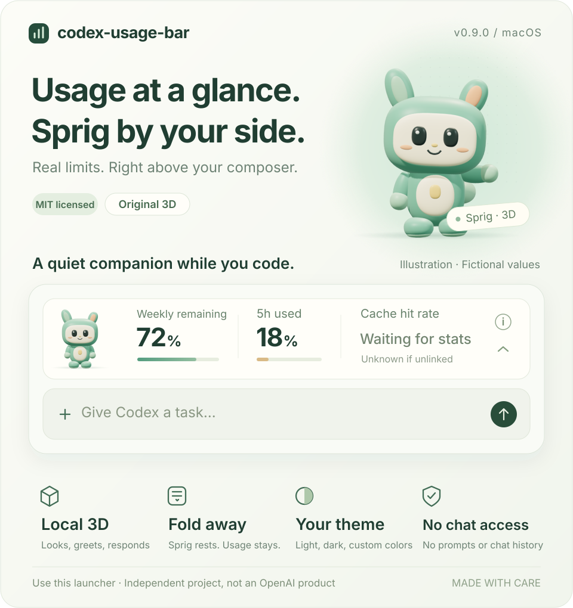
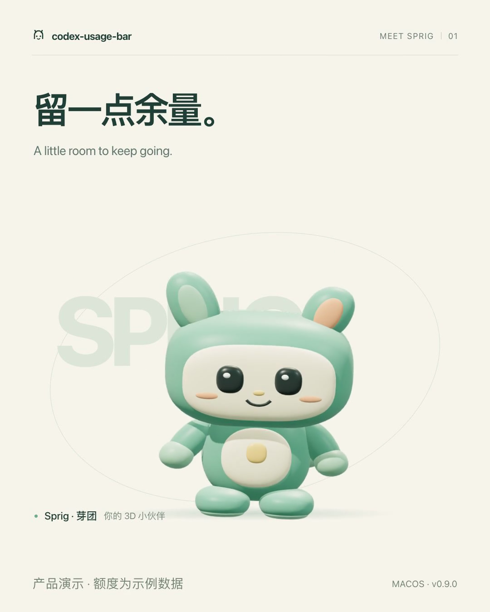

# codex-usage-bar

[English](README.en.md) | [简体中文](README.md)



A usage bar for your everyday Codex desktop instance, with Sprig, an original 3D companion styled as a soft vinyl toy. Version **0.9.0 for macOS**. This shared repository reserves platform directories for a future Windows implementation.

**Meet Sprig in 24 seconds** · 1080 × 1350, 60 fps, with an original score. Click the poster to open the video file on GitHub.

<a href="https://github.com/manson341349-beep/codex-usage-bar/blob/main/docs/assets/sprig-product-film.mp4"></a>

[Watch the film](https://github.com/manson341349-beep/codex-usage-bar/blob/main/docs/assets/sprig-product-film.mp4) · [Download MP4](https://raw.githubusercontent.com/manson341349-beep/codex-usage-bar/main/docs/assets/sprig-product-film.mp4) · [Edit and rebuild the animation](promos/sprig-remotion/README.en.md)

The film uses example usage values and offline rendering. Its frame rate is not a plugin performance measurement, and the character's performance does not indicate real Codex work activity.

**Language:** The bar follows Codex's app language in real time: Chinese language variants use Simplified Chinese, and all other languages use English. The menu bar follows on its next status refresh; before connecting to Codex, it uses the system language to choose English or Chinese. Language changes preserve quota data, cache statistics, and the current expanded or collapsed state. GitHub READMEs do not switch automatically with the app; use the links above to choose a documentation language.

> **See your usage limits just above Codex's native composer, on both the home screen and conversation pages.** Keep your existing account, history, settings, and projects. Typing, using an input method, or entering a conversation no longer causes the bar to unmount. This is a launcher companion for the original Codex app; it does not modify the official application bundle.
>
> **Enable it through this project's launcher.** It can reconnect to an everyday instance previously opened by the launcher after verifying its identity. An instance opened directly from the official icon must first be quit normally, then reopened through the launcher. Real work events and Windows support are not implemented. Cache hit rate waits for a real statistics notification from the current session. Offline checks and actual app verification are documented separately in the [validation record](docs/VALIDATION.md); anything not recorded as passing remains unverified.

## Install and use with your everyday Codex

Running the app requires the official `/Applications/Codex.app`, an existing Python 3.12+ installation, and the default profile directories already used by Codex: `~/.codex` and `~/Library/Application Support/Codex`. Custom profile paths are not supported in this version. The companion does not copy login credentials, create a replacement account, or require you to sign in again.

Building from source also requires an existing Xcode or Command Line Tools installation (`xcrun swiftc`). The installer does not download or install a compiler. Extract the source archive and run this from the source directory:

```sh
python3 platforms/macos/install.py
```

The release source archive includes the local Sprig runtime bundle. Normal installation and use do not require Node.js, npm, or an online model download. The development dependencies below are needed only if you change the character's source and rebuild its bundle.

Then double-click `~/Applications/codex-usage-bar.app`, or run:

```sh
open "$HOME/Applications/codex-usage-bar.app"
```

The companion refreshes quietly in the background, **without opening a terminal or a control window**. The usage bar stays above your everyday Codex composer. The **Usage** menu in the macOS menu bar (labelled **额度** in Chinese) provides status, stop, restart, and quit controls; normal use does not require opening it.

If the current Codex instance was opened by this launcher, the companion reconnects directly. If it was opened normally from the official icon, the menu shows a waiting state and asks you to save your work and quit Codex normally. The launcher then reopens it with the same profile. It does not forcibly end your ongoing work.

Use **codex-usage-bar.app** to open your everyday Codex from then on. A cold launch from the official icon does not automatically include the debugging arguments needed by the bar. The companion does not add a login item, replace your Dock icon, or replace official Codex files.

**Stopping and quitting:** Choosing Stop or Quit from the Usage menu asks only the manager started by this companion to remove its own bar; your everyday Codex keeps running. A cleanup failure is reported explicitly and never causes Codex to be force-quit. To close the local debugging port, quit Codex normally with Cmd-Q. The port listens only on `127.0.0.1`; do not expose it to untrusted programs.

This local app is not developer-signed or notarized and requires external Python and Codex installations. Build outputs may have a temporary signature generated by the compiler. Installation does not download dependencies, change Codex's signature, bypass Gatekeeper, add a login item, or request new sensitive system permissions.

## Current capabilities and limitations

- The bar's left and right edges align with the native composer shell and follow the window's width and zoom. Expanded, collapsed, and detail views keep the same width. The companion adjusts only its own bar and does not restyle the native composer.
- A separate Shadow DOM bar mounts above the native home-screen or conversation composer. It follows the composer while you type, compose text with an input method, or switch conversations. It neither replaces the composer nor reads prompt text or chat content.
- Everyday mode supports the room composer when it lacks a native upper portal. Only after the known two-branch structure and geometry checks pass does it add its own slot in normal document flow before the composer shell, without changing native node styles. The slot is removed if space is insufficient or the structure does not match. The original portal path retains its strict checks.
- Subscription limits come from the official CLI's read-only `account/read` and `account/rateLimits/read` calls, refreshing roughly every 60 seconds. The weekly window shows the **percentage remaining**: 100% minus the official used percentage. Its number and progress bar use the same definition. The five-hour window continues to show the percentage used.
- Missing five-hour or weekly windows, an unverified account identity, stale data, or a pending reset are shown explicitly as unknown or as a status. **Missing data does not mean unlimited usage.** There is no account-bound setting to declare usage unlimited based on user confirmation.
- Cache hit rate comes from Codex's existing session-statistics notifications: cumulative cached input tokens divided by cumulative input tokens for the current session. It also remains visible in the collapsed row. Notifications must match both the current composer's session UUID and the sidebar host identifier. Missing or conflicting identifiers, or invalid counts, produce an unknown or waiting state. Switching sessions immediately clears old statistics. After initial attachment, a page refresh, or a switch to another session, the display waits for the next real statistics notification; it does not read historical logs. With no new notification for more than two minutes, the value is marked as the last recorded statistics. This is neither context-window utilization nor an account-wide cache hit rate.
- If the room composer does not expose a verifiable session association, cache hit rate remains unknown while subscription limits continue to refresh. The companion does not guess which session owns the statistics. The original thread composer continues to use real cache notifications when its session UUID and host match are valid.
- The bar inherits Codex's current background, text, border, and accent colors. Sprig keeps its mint-colored body, lightly blends in the theme accent, and adjusts exposure for light or dark appearances. Theme changes, including custom colors, do not require a restart. Built-in light and dark colors are used if the host theme variables are unavailable. Those variables are internal Codex interfaces.
- Sprig renders locally in a **56 × 56 CSS pixel** slot and normally faces you. It has subtle idle motion, brief pointer tracking, greetings on hover or keyboard focus, and a playful response to clicks. The project's original implementation defines the model, materials, and movements; rendering uses the bundled Three.js library.
- The arrow folds the bar into a single-row usage summary. Folding hides Sprig, stops its frame loop, and removes pointer listeners. Expanding restores the same character instance. The character also pauses when the page loses visibility or the window loses focus. Actual unmounting releases its geometry, materials, textures, and WebGL context.
- With the system's Reduce Motion setting enabled, Sprig responds with still poses instead of continuously playing animation. If WebGL is unavailable or rendering fails, a clear, original 2D Sprig takes over while usage and cache displays continue to work.
- Real work events are not connected yet, so character motion does not indicate that the model is generating a response. Working and completion performances are design demonstrations only, not indicators of Codex's actual execution state.
- Click `i` to see the source details. Click it again, click outside, or press Esc to close them. Hover and keyboard focus do not automatically open the details. See the [validation record](docs/VALIDATION.md) for the scope of performance checks; the project does not promise a steady 60 fps on every device.
- Everyday mode supports multiple Codex app pages within the same verified instance and remounts after a page reload or composer replacement. It supports only the default profile paths and does not switch conversations, navigate pages, or send messages on your behalf.
- The bar appears only when a compatible native composer is available. It stays hidden on pages without a composer, such as sign-in and settings, and in layouts where the composer's position cannot be verified or there is too little space. Codex's DOM is an internal interface, so app updates may require compatibility changes.
- Startup or connection failures leave your everyday Codex running. If it was already opened with debugging arguments, you must quit it with Cmd-Q to close that port. The companion never force-quits the app to repair the bar.

## Isolated test mode

The isolated test mode from version 0.3.0 is still available, but it is not the `.app` default. Open `platforms/macos/Test.command` in the installed resources only when you need it for testing. This mode uses a separate profile and retains the old `homeOnly` behavior: it shows the bar only on the empty home screen and unmounts it after typing or entering a conversation. That does not describe everyday mode. Ctrl-C closes the dedicated test instance; everyday mode removes only its bar and leaves Codex running.

The source commands `run`, `login`, `status`, and `cleanup` still refer only to isolated test mode. `daily` and `daily-status` refer to everyday mode. For example:

```sh
python3 -B -m codex_bar daily --acknowledge-runtime --wait-for-exit
python3 -B -m codex_bar daily-status
```

`--acknowledge-runtime` indicates that the operator has agreed to local debugging access for this run. The migration installation option `--use-approved-project-profile` affects only a verified legacy profile binding in isolated Test mode; everyday mode uses the original default profile.

## Upgrade, uninstall, and restore

First choose Quit from the Usage menu to stop the companion and its manager. For older versions started in an external terminal, use Ctrl-C. The installer refuses to overwrite an installation while the manager lock is held. Run the installation command again to upgrade. The old `.app` is kept in `~/Applications/.codex-usage-bar-backups/`, and the original profile is not migrated.

An everyday Codex instance already enabled by this launcher can keep running. After the old manager successfully removes its bar, the new companion verifies the saved process identity and local port before reconnecting. This requires restarting the usage-bar companion; it is not a hot replacement of a running manager. If cleanup or identity verification fails, follow the explicit message instead of forcing a takeover of the old bridge.

To uninstall, run this from your retained source directory:

```sh
python3 platforms/macos/install.py --uninstall
```

Uninstallation removes an `.app` only if it carries this project's installation receipt. It retains backups, private runtime state, and all login data. It does not close your running everyday Codex instance; you still need to quit Codex yourself to close an existing debugging port. Reinstalling restores the launcher. To return completely to your previous setup, quit Codex normally and open it from the official icon. The official application bundle needs no repair.

## Data and development

The usage bridge derives an account identity fingerprint in memory from official account metadata. It does not output that identity or write a usage cache to disk. Official Codex handles sign-in and networking. This project does not read authentication files, chat history, or prompt text, and does not send model-generation requests. The current session UUID and host identifier are used only in page memory to match notifications; they are not exported to a backend, logs, or public packages. From those notifications, the companion copies only the two cumulative input and cached-input token counts. Lifecycle files contain only the local metadata needed to verify process ownership, stay in the private support directory, and are not uploaded.

The character runtime, modeling, and animation sources are in `web/sprig-source/`, and the local Three.js r180 module is in `web/vendor/`. Development uses Node.js 22 and the pinned esbuild 0.25.11 to produce the single `web/sprig.js` bundle. That runtime does not load code from a CDN. The initial development-dependency installation needs access to npm:

```sh
npm ci --ignore-scripts
node scripts/build-sprig.mjs
node scripts/build-sprig.mjs --check
```

`--check` rebuilds the bundle and compares it byte for byte with the committed version. After changing frontend assets, also update the corresponding SHA-256 values in `web/asset-manifest.json` before running validation. The fixed asset allowlist permits the Sprig bundle to be at most 2 MiB; each other JavaScript or CSS asset is still limited to 256 KiB. The runtime package includes the Three.js MIT license. Development-dependency manifests and module source files appear only in the source archive.

```sh
python3 scripts/validate.py
python3 -B -m unittest discover -s tests -v
python3 -B -m unittest discover -s platforms/macos -p 'test_*.py' -v
node --test tests/test_frontend.js tests/test_sprig_runtime.js tests/test_i18n.js
python3 platforms/macos/build.py
python3 platforms/macos/build.py --source-output dist/codex-usage-bar-v0.9.0-source.zip
```

The build uses only allowlisted files, compiles the native menu-bar launcher, and refuses to overwrite existing outputs. Test data is synthetic. Actual everyday-use verification and offline tests are reported separately. `codex_bar/` contains both isolated and everyday lifecycle code; `web/` contains the project's own frontend and the licensed Three.js code; `platforms/macos/` is the current platform entry point. `platforms/windows/` is reserved for future work.

This project is independent of OpenAI. Its own code and original visual assets use the [MIT License](LICENSE); Three.js remains covered by the bundled [upstream MIT license](web/THREE-LICENSE.txt). See [PROVENANCE](docs/PROVENANCE.md) and [NOTICE](NOTICE.md) for the source boundaries. The project does not distribute or relicense Codex, Python, system components, or early reference software.
